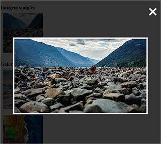
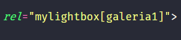
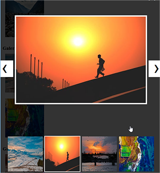
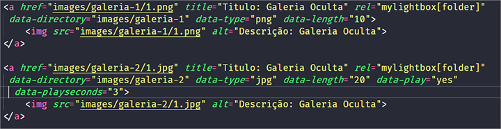

<h1>Lightbox com galeria de imagens</h1>

<a href="https://phscezario.github.io/lightbox-slide-gallery-folder/">Veja aqui</a>

<h2>Como usar:</h2>

<h3>Imagem Simples</h3>

Usado para apenas uma imagem na lightbox.

Adicionar a rel mylightbox no elemento < a >, exemplo:

 

< a href="link da imagem" rel="mylightbox" >

<h3>Galeria de imagens na pagina</h3>

Usado para uma galeria com imagens dentro de uma pagina web.

Necessariamente as imagens não precisam estar dentro do mesmo elemento pai na pagina, apenas precisam conter o mesmo nome de galeria.

Adicionar rel com o nome da galeria no elemento < a >, exemplo:

 

< a href="link da imagem" rel="mylightbox[Nome da galeria]">

Desta forma todas imagens da galeria vão aparecer como thumbnails

<h4>Considerações</h4>

-   As fotos podem ser trocadas com um simples clique na miniatura, com as setas do teclado(left e right) ou clicando nos botões que aparecem ao lado das fotos na versão desktop;

-   Existe um scroll de clique e touch caso o tamanho da galeria de miniaturas exceda o tamanho do screen;

-   Caso deseje que todas imagens de uma pagina apareçam em uma única galeria colocar o nome da galeria como "all".
    < a href="link da imagem" rel="mylightbox[all]">

<h3>Galeria com imagens em um diretório</h3>

Usado para uma galeria com imagens dentro de uma pasta.

Ficara uma imagem como capa e ao clicar serão carregadas todos imagens dentro de uma pasta, desde que todos os requisitos sejam atendidos.

<h4>Requisitos</h4>

Elemento do HTML deve conter os atributos:

-   rel="mylightbox[folder]", indicando que as fotos estão em uma pasta;

-   data-directory="diretório contendo as imagens";

-   data-type="jpg", é o tipo das imagens, elas precisam conter o mesmo tipo, não importando se são, `gif, png, jpg e etc`;

-   data-length="20", numero de imagens dentro da pasta, as imagens devem ser nomeadas numericamente e sequencialmente, exemplo: 1.png, 2.png, 3.png...

Atributos não obrigatórios:

-   data-play="yes", caso queira que a imagem de capa fica trocando aleatoriamente;

-   data-playseconds="3", caso habilite a troca de imagem, é necessário colocar esse atributo para definir tempo de troca das imagens em segundos.

< a href="link da imagem" rel="mylightbox[folder]" data-directory="Diretório de imagens" data-type="extensão das imagens" data-length="Numero de imagens" data-play="Se imagem vai trocar" data-playseconds="Tempo de troca" >

